## Firmware 2.2.1(4) User Manual [Nov 10, 2025]

### Introduction

**OpenSprinkler** is an open-source, web-based sprinkler/irrigation controller designed as a drop-in replacement for conventional sprinkler controllers that lack web connectivity. Its key benefits include an intuitive user interface, remote access, and smart weather-based watering control. It is ideal for homeowners and businesses in applications such as lawn and garden watering, plant irrigation, drip irrigation, hydroponics, etc.

The OpenSprinkler hardware comes in two flavors:

* **OpenSprinkler v3** – Features built-in WiFi, two independent sensor ports, and an optional wired Ethernet module. It is fully assembled and pre-loaded with firmware.
* **OpenSprinkler Pi (OSPi)** – Powered by a Raspberry Pi (RPi), requiring some assembly (such as connecting the RPi) and firmware installation.

Each controller provides 8 zones, with expansion possible via zone expanders (each adding 16 zones): **OpenSprinkler v3** supports up to **72** zones, and **OSPi** supports up to **200** zones.

In addition, OpenSprinkler v3 is available in three power models:

* **AC-powered** – Comes with an **Orange** terminal block (v3.0-3.3) or **Red** power barrel (v3.4). Requires a 24VAC transformer (NOT included by default; available for purchase as an add-on, or use your own 24VAC transformer).
* **DC-powered** – Comes with a **Black** power barrel (v3.0-3.3) or **USB-C** connector (v3.4). A compatible power adapter is included for North America. It can operate on 6V–24VDC, including a 12VDC solar panel. Despite DC input power, it is designed to operate 24VAC sprinkler valves, as well as DC non-latching valves.
* **LATCH** – Comes with a **Black** power barrel and a 7.5VDC adapter for North America. It's specifically designed for use with **latching solenoid valves only**.

### What's New in this Firmware?

* **Support for DC-powered OpenSprinkler v3.4**, the first OpenSprinkler with USB-C. Supports USB PD (Power Delivery) via CH224 and allows **user-defined PD voltage**.
* **Preemptive Running for Manual Actions:** Manual station runs, Run-once programs, and manually started programs now support user-specified queue options:
    * **Append**: run after others
    * **Insert at Front**: run now and pause others
    * **Replace**: run now and stop others (**default behavior in previous firmwares**).
* **OSPi GPIO Backend**: Switch from `libgpio` to `lgpio`, for simpler API, compatible with **Raspbian Trixie**, and to avoid `libgpiod` v2 breaking changes.
* **Smoother Current Readings:** Added exponential moving average (EMA) filtering for stable current sensing.
* **Flexible Weather Script URL:** Support explicit `http/https` and custom port, making it easy to use custom weather service.
* **Optimized Static Pages:** Serve AP homepage and firmware update pages as minified and compressed HTML for faster load times and reduced footprint.

### Hardware Interface

#### OpenSprinkler v3.4 (new) {: .hltitle}

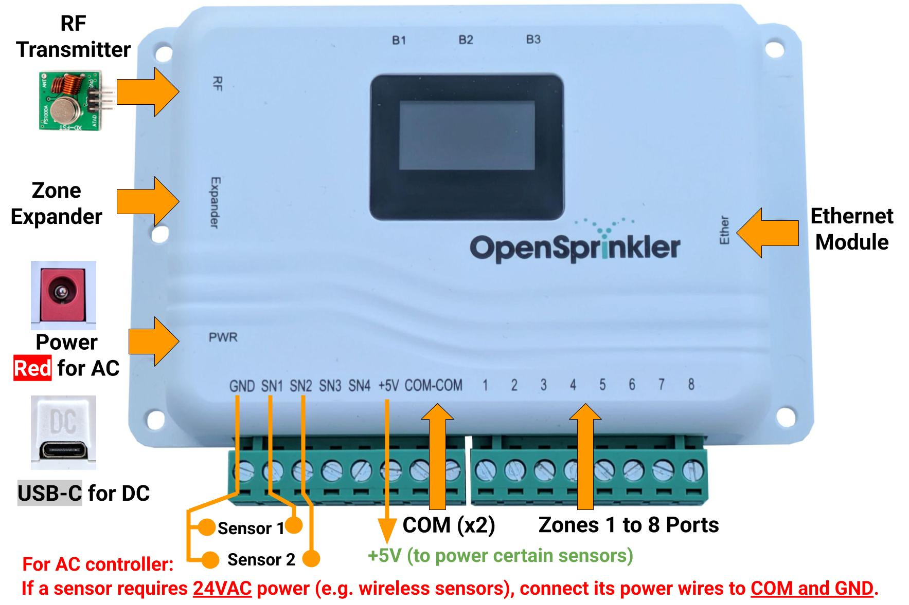

#### OpenSprinkler v3.0-3.3 {: .hltitle}

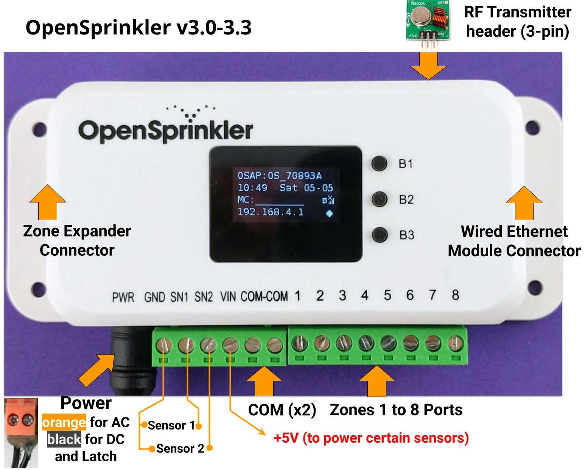

#### OpenSprinkler Pi (OSPi) {: .hltitle}

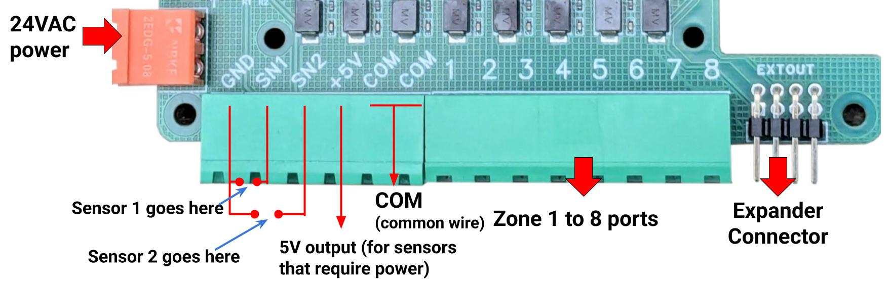

### Zone Wiring Diagram

The diagram below shows how to wire valves on the main controller and expanders.

**Basics**

* Each valve solenoid has two wires. Gather one wire from every valve (across the main controller and any expanders) and bundle them into a **COM (common)** wire. Connect this **COM** wire to the controller's **COM** port (do NOT use GND).
* OpenSprinkler has **two COM ports**: they are internally connected, so you may use either one.
* The other wire from each valve goes to its individual zone port (1, 2, 3, ...).

**Polarity**

* **AC valves** have no polarity — either lead can be COM or zone wire.
* **Latching valves** are ***polarized*** — connect the **positive** wire (usually **Red**) to **COM**, and the negative wire (usually **Black**) to a zone port.
* Some DC non-latching valves are polarized too. Again, positive → COM, negative → zone.

**Master Valve / Pump Relay**

* If you have a master valve or pump start relay, connect it to any zone port — OpenSprinkler uses software-defined master/pump zones, so you can configure which zones act as master.

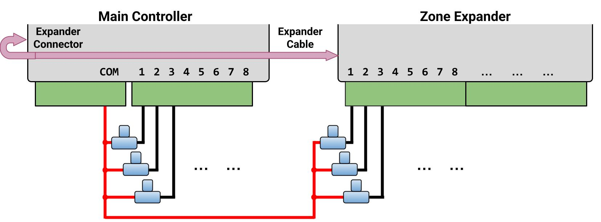

### Installation

!!! warning "AC Power (International Users)"
    For **AC-powered** OpenSprinkler, you must use a 24VAC transformer that **matches your country’s mains voltage** standard. An incompatible transformer can damage the controller. If a suitable 24VAC transformer isn't available, consider the **DC-powered** OpenSprinkler instead (6–24VDC input; v3.4 uses USB-C). **Never** connect mains power directly to the controller.

!!! warning "OpenSprinkler is NOT waterproof"
    If installing outdoors, mount it inside a [**weatherproof enclosure**](https://www.amazon.com/Orbit-57095-Weather-Resistant-Outdoor-Mounted-Controller/dp/B000VYGMF2).

!!! info "Video Guides"
    **Video Guides and Tutorials** are available on the [OpenSprinkler support site](https://support.opensprinkler.com).

#### Step 1: Preparation

Carefully label and remove wires from your existing sprinkler controller as you disconnect it. You will typically find:

* **Power supply wires** (if you plan to reuse your existing power supply)
* A **COM (common) wire**
* One or more **Zone wires**
* (Optionally) A **Master Zone / Pump Start Relay** wire
* (Optionally) **Rain / Soil / Flow Sensor** wires

---

#### Step 2: Wiring OpenSprinkler

Refer to the [Hardware Interface](#hardware-interface) and [Zone Wiring Diagram](#zone-wiring-diagram) sections above.

OpenSprinkler uses **removable terminal blocks** for easy wiring. To detach a block, grab one end firmly, gently wiggle, and pull it out. Insert wires fully, then tighten the screws securely.

**Power:**

* **OpenSprinkler v3.4 AC:** Plug the 24VAC transformer to the **Red** barrel jack.
    * If your transformer has bare wire, use the included screw-terminal-to-plug adapter.
* **OpenSprinkler v3.0-3.3 AC:** Connect the 24VAC wires to the **Orange** terminal block.
    * AC has no polarity, so the two wires have no distinction.
* **OpenSprinkler v3.4 DC:** Plug the USB-C cable to the USB-C port (PWR).
* **OpenSprinkler v3.0-3.3 DC and Latch:** Insert the DC adapter into the **Black** barrel jack.
    * Note the **COM** terminal is **positive(+)**. If your valve wires are polarized, positive goes to COM, and negative goes to a zone. 

**Sensors:**

* **Connect sensor signal wires to SN1 + GND** (or **SN2 + GND** if using a second sensor).
    * OpenSprinkler uses **GND** (NOT COM) as the common terminal for sensor inputs. **DO NOT** connect sensor signal wires to **COM**.
* On a **AC-powered model**, if a sensor requires 24VAC power (e.g. wireless sensors), you may connect its **power wires** to COM and GND, which supply 24VAC.
    * **DC-powered and Latch** models do **NOT** output 24VAC thus cannot power these sensors.

For additional details on specific sensors (rain/soil/flow), refer to [Sensor Setup](#sensor-setup).

---

#### Step 3: Zone Expanders (Optional)

!!! warning "Power Off Before Wiring Expanders"
    Always **power off the main controller** before making changes to expanders (connecting, disconnecting, reconfiguring).

!!! warning "Verify the Correct Port"
    Check [Zone Wiring Diagram](#zone-wiring-diagram) to verify it's plugged into the correct port. Do **NOT** plug into the port marked **Ether** (that's for Ethernet module)!

* With the main controller powered off, plug one end of the expander cable into OpenSprinkler’s **Zone Expander** port (keyed; only fits one way).

* **Connect the other end of the cable**:
    * **OpenSprinkler v3:** to either side of the expander (the two ports are equivalent). For multiple expanders, link them with additional cables.
    * **OpenSprinkler Pi (OSPi):** to the expander's **IN** port. For multiple expanders, daisy-chain by following the **OUT → IN** links.
* **Set Index:** 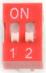{ .img-shadow .img-border style="float: right; margin: 5px 5px 5px 5px;"}
    * For **OpenSprinkler v3**, you MUST set a unique index (1-4) for each expander, using the DIP switch on its back (see picture on the right).
        * `1st` expander: index `1` (DIP switch: `DOWN DOWN`)
        * `2nd` expander: index `2` (`UP DOWN`)
        * `3rd` expander: index `3` (`DOWN UP`)
        * `4th` expander: index `4` (`UP UP`).
    * For **OSPi**: there is no DIP switch - the expander index is implied by the order the expanders are daisy-chained.
* **Zone Mapping:**
    * Main controller: zones `1-8`
    * `1st` expander: zones `9-24`
    * `2nd` expander: zones `25-40`
    * `3rd` expander: zones `41-56`
    * `4th` expander: zones `57-72`

**<u>Select Number of Zones</u>:** The firmware automatically detects the highest expander index, but you still **must manually set the total number of zones** in software settings. You may enable more zones than physically available, to use them as **Virtual Zones** (Remote/HTTP(S)/RF). See [Station Types](#station-cards).

---

#### Step 4: Setting Up WiFi / Ethernet

**WiFi (OpenSprinkler v3 all versions)**

1. On first boot (or after WiFi reset), OpenSprinkler starts in **AP (Access Point) mode**, broadcasting an SSID like `OS_xxxxxx` shown on the LCD. Connect your phone/computer to this open SSID.
    * *On Android*: if you see a "WiFi has no Internet" warning, tap Accept to stay connected.
2. Open a browser and go to `192.168.4.1` to access the **WiFi Configuration** page. Follow the instructions there. Specifically, select (or manually enter) your home WiFi's SSID and its password (this is your router's WiFi password, NOT OpenSprinkler's password!). The BSSID and Channel fields are filled automatically, but you may leave them empty if preferred.
3. Click **Connect**. On successful connection, the controller will reboot into WiFi Station mode.
4. Press button **B1** on OpenSprinkler to display the **device IP** assigned by your router. Type in that device IP in a **browser** or the **OpenSprinkler mobile app** to access the web interface.
    * The default device password is **opendoor**. For security, change this immediately after setup.

---

**Wired Ethernet (OpenSprinkler v3.2 and later)** 

* **Power off** the main controller. 
* **OpenSprinkler v3.4:** Firmly plug the ribbon cable connector into the port on the controller marked **Ether** (it's on the **right** side of the controller).
    * Do **NOT** plug into the port marked **Expander** - that's for zone expander ONLY!
    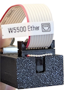{ .img-shadow style="float: right; margin: 5px 5px 5px 5px;"}

* **OpenSprinkler v3.2-3.3:** Firmly plug the ribbon cable connector into the Ethernet module as shown on the right (keyed; only one way to fit).
* Plug an RJ45 Ethernet cable from your network to the module.
* Power on the controller. It will detect the network and connect automatically.

---

#### Reset WiFi
* To re-enter AP mode without erasing other settings:
    * With the controller powered on, press **B3+B2** (first press B3 then while holding B3 quickly press B2, like `Ctrl+C`), and hold until you see **Reset to AP mode?**.
    * Click **B3** to confirm.
* You can also reset WiFi from the app/web UI under:
    * From the homepage: **Edit Options → Reset → Reset WiFi**.
* If neither of the above works, you need to perform a Factory Reset (see below).

---

#### Reset Device Password

If you forget the device password, you can bypass it using buttons:

1. Power off the controller.
2. Power it on, and as soon as the OpenSprinkler logo appears, press and hold **B3**. Keep holding until the LCD displays **Setup Options**.
3. Click **B3** repeatedly until you see **Ignore Password**. Click **B1** to set it to **Yes**.
4. Press and hold **B3** until the controller reboots.

You can now access the UI without a password. For security, immediately set a new password, and change **Ignore Password** back to **No**.

---

#### Factory Reset

1. Power off the controller.
2. Power it on, and as soon as the OpenSprinkler logo appears, press and hold **B1**. Keep holding until the LCD displays **Reset?**
3. Confirm the answer is **Yes**, then press and hold **B3** until the controller reboots.

All settings will be cleared and returned to factory defaults.

### LCD Display and Buttons

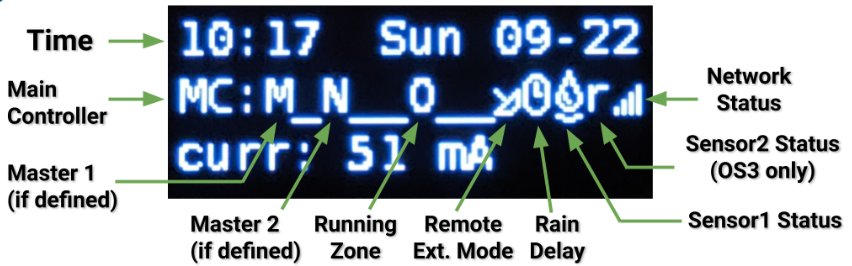{: .img-border .img-shadow}

* **Master 1** (if enabled) is shown as the letter `M`; and **Master 2** as `N`.
* By default the LCD shows the status of the first 8 zones on the main controller (`MC`). Each running zone is displayed with a three-letter animation: `. o O`
* Click **B3** to cycle through each group of 8 zones (`E1`, `E2`, `E3`...) on expanders. 
* When no zones are running, a `(System Idle)` message is shown at the top.
* When the controller is in **Remote Extension** mode, a radar icon 📡 is shown.
* When **Pause Queue** or **Rain Delay** is active, a clock icon 🕒 is shown.
* If **Sensor 1** is configured, a letter is shown to indicate its type:
    * `r`: Rain sensor
    * `s`: Soil sensor
    * `p`: Program switch
    * `f`: Flow sensor
    * An activated rain sensor is shown as 🌧️, and active soil sensor as 💧.
* If **Sensor 2** is configured, its display will follow the same notation as Sensor 1.

**While the controller is running, buttons perform the following functions:**

| Button     | Function |
|:-----------|:---------|
|**Click B1**|Display device IP address, port and OTC status|
|**Click B2**|Display device MAC address|
|**Click B3**|Switch between the main controller (`MC`) and each group of 8 expanded zones (`E1`, `E2`, `E3` ...).|
|**Hold B1** |Stop all zones immediately|
|**Hold B2** |Reboot the controller|
|**Hold B3** |Manually start an existing or test program|
|**B1+B2**   |Hold **B1**, then while holding it press **B2**, like `Ctrl+C`. Display gateway (router) IP|
|**B2+B1**   |Display external (WAN) IP|
|**B2+B3**   |Display timestamp of the last weather server response|
|**B3+B2**   |For OpenSprinkler v3: reset to AP mode (for WiFi re-config)|
|**B1+B3**   |*(Internal testing only)* Start a quick test program (2s per zone)|
|**B3+B1**   |Display last system reboot timestamp and reboot reason|

**During booting, <u>while the OpenSprinkler logo is shown</u>, if any button below is pressed:**

* **B1**: start **Factory Reset**.
* **B2**: start **Internal Test Mode**.
* **B3**: start **Setup Options**.

### Web Interface Overview

OpenSprinkler’s web interface works on phones, tablets, and computers, enabling you to view status, adjust settings, check logs, and edit programs from any modern **web browser** or via the free **OpenSprinkler mobile app** (search **OpenSprinkler** in your app store). 

!!! info "Video Guides"
    **Video Guides and Tutorials** are available on the [OpenSprinkler support site](https://support.opensprinkler.com).

--- 

**Local Access**

* On the controller, press button **B1** to find its **device IP** and **HTTP port**. We denote the IP as `os-ip` (e.g. `192.168.1.122`).
* Open a browser and visit `http://os-ip` (e.g. `http://192.168.1.122`). If you changed the HTTP port from the default `80`, include it in the URL (e.g. `http://os-ip:8765`).
* The default device password is **opendoor**. For security, change it upon first use.
* When using the OpenSprinkler mobile app, choose **Manually Add Device**. Enter the device IP.
* Using the IP to access the controller works as long as you are on the same local network.

--- 

**Remote Access (via OTC)**

* To access the controller remotely, first configure an [**OpenThings Cloud (OTC) token**](#integration).
* In the OpenSprinkler mobile app, choose **Manually Add Device** and paste the **OTC token** instead of an IP.
* To access it remotely using a web browser, visit `cloud.openthings.io/forward/v1/token` where `token` is the [OTC token](#integration). 
* Remote access via OTC does **NOT** need port forwarding on your router.

### Homepage

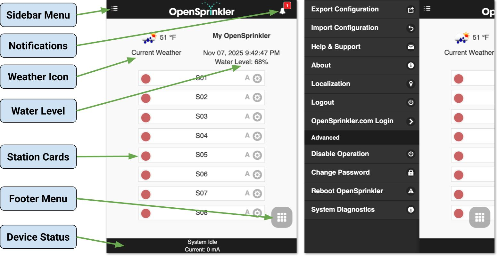

The homepage provides an overview of all zones, current system status, and weather conditions. You’ll see a **weather icon**, the **device time**, **water level**, a **list of zones** showing their current state, and the **device status** at the bottom.

* The bell icon 🔔 (upper right) appears when notifications are available.
* The menu icon ☰ (upper left) opens the sidebar menu.

---

#### Sidebar Menu

!!! info "Open the Sidebar"
    Open the sidebar menu anytime by **swiping left to right**, or tap the ☰ icon at the top-left corner.

* **Manage Sites:** Manage multiple controllers (available in the mobile app).
* **Export/Import Configuration:** Save or restore all settings and programs. Use this before firmware upgrades or factory resets.
* **About:** Shows app version, firmware version, and hardware version.
* **Localization:** Change the display language.
* **OpenSprinkler.com Login:** (Optional) Log in with your [OpenSprinkler.com](https://opensprinkler.com) account credentials to enable [**cloud-synced features**](#cloud-synced-features) such as station photos, notes, site configurations.
* **Disable Operation:** Disable zone operations. Use it when the system will be idle for an extended period.
* **Change Password:** Change the device password.
* **Reboot OpenSprinkler:** Perform a software reboot.
* **System Diagnostics:** View detailed diagnostic data, including timestamp and reason of the last reboot, the last weather call, response code, weather data, and OpenThings Cloud (OTC) connection status.

---

#### Device Status

The footer reports system status, prioritizing the following information in order:

1. System enable/disable state
2. Currently running stations
3. Active Pause Queue / Rain Delay status
4. If idle, the Last Run station, or **System Idle** if no such data is available.

Additional data to display:

* If Flow Sensor is enabled → **Current Flow Rate**.
* If any zones are active → **Total Current Draw** (useful for solenoid diagnosis).
* If **Overcurrent detected** → an **Overcurrent Alert**.

---

#### Station Cards

Each zone (station) is shown as a card. Tap the gear ⚙️ icon next to a zone name to open its **Attributes** dialog.

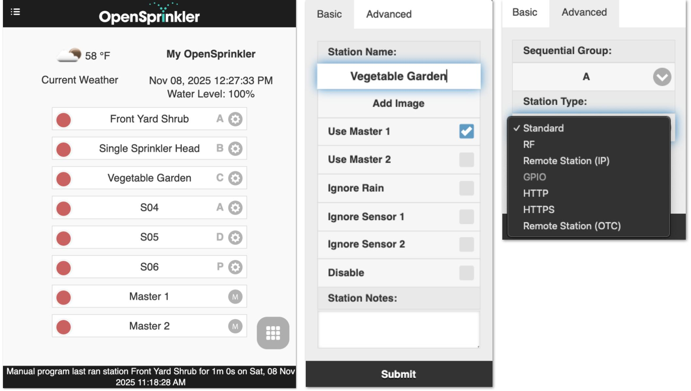{: .img-shadow}

**Basic Tab:**

* **Station Name:** A custom name (up to 32 letters). 
**Annotation:** If a flow sensor is enabled (see [Sensor Setup](#sensor-setup)) and the last 5 letters represent a numerical value, a **Flow Alert** notification will trigger when the flow rate exceeds this value after the zone finishes. Example: station name is **Front Yard 1.357**, a flow alert will trigger if the flow rate `>1.357` after the zone finishes.
* **Use Masters:** When enabled, the associated Master zone(s), if defined, will activate whenever this zone runs.
* **Ignore Rain/Sensor1/Sensor2:** When enabled, the zone will bypass manual rain delay or sensor(s). Unchecked by default.
* **Disable:** Disable and hide this zone. To unhide, use the [Footer Menu](#footer-menu).

**Advanced Tab:**

* **Sequential Group:** Assign the zone to a **Sequential** group (`A-D`) or the **Parallel** (`P`) group. The zone's group label appears next to its name on the homepage.
    * By default, all zones belong to **group A**.
    * Zones in the same sequential group are **automatically serialized** – no two zones run simultaneously.
    * Zones in different groups can run simultaneously.
    * Parallel (P) zones can run alongside any other zones.
    * The sequential group attribute replaces the old per-zone **Sequential** flag, providing more flexible concurrency control.

* **Station Type** (Virtual Zone): Configure special properties so a station can control devices or actions beyond a standard sprinkler valve. These **special/virtual** station types do NOT consume a physical output - you can define them freely up to the controller’s maximum zone count, even without zone expanders.
    * **Standard** (default): Regular sprinkler zone.
    * **RF:** Controls remote RF (Radio Frequency) power sockets via an external transmitter (requires [RFtoy](https://opensprinkler.com/product/rftoy/) for code learning), allowing you to switch powerline devices such as Christmas lights, heaters, pumps.
    * **Remote Station (IP):** Triggers a zone on another OpenSprinkler using its **IP, port, and zone index** (both controllers must **share the same device password**).
    * **Remote Station (OTC):** Same as above but identifies the remote controller by its **OpenThings Cloud token**, ideal for managing devices across different networks. Again, both controllers must share the same password.
    * **GPIO:** Directly toggles an available GPIO pin on the controller (Active High/Low configurable). This type is disabled for controllers that do not have any available GPIO pins.
    * **HTTP:** Sends an HTTP GET request upon zone activity. Provide a `server` (either domain name or IP), `port`, and the `on`/`off` command (excluding the leading slash `/`). Upon zone activation, it sends `server:port/on_command`, and upon deactivation `server:port/off_command`.
    * **HTTPS:** Same as HTTP, but using a secure connection.

---

#### Cloud-Synced Features

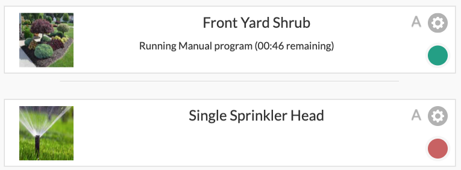{: .center }

After signing in with your **OpenSprinkler.com** account (via the sidebar menu), additional **cloud-synced** features become available:

* **Station Photos & Notes:** Capture and assign custom images and notes to each zone.
* **Site Configuration Sync:** Automatically store and restore your device list and settings across devices, making it easy to manage multiple controllers.

### Footer Menu
{ .img-shadow width="200" style="float: right; margin: 8px 0px 8px 16px;"}
The Footer Menu is available on all pages from the bottom-right (grid icon #️⃣) providing quick access to common actions:

* **Preview Programs** (or keyboard shortcut `Alt+V`)
* **View Logs** (`Alt+L`)
* **Change Rain Delay** (`Alt+D`)
* **Pause Station Runs** (`Alt+U`)
* **Run-Once Program** (`Alt+R`)
* **Edit Programs** (`Alt+P`)
* **Edit Options** (`Alt+O`)
* **Stop All Stations**
* **Show/Hide Disabled** (available on the homepage): Toggle visibility of zones that have been disabled.

**Tip:** On laptop/desktop computers, you can also open the menu by pressing `M`.

---

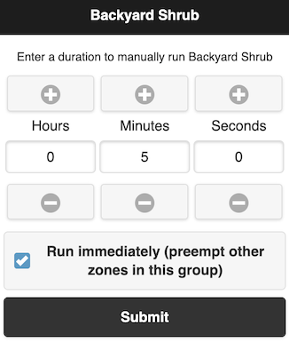{ .img-border .img-shadow width="150" style="float: right; margin: 5px 5px 5px 5px;"}

#### Manually Start / Stop a Zone

To **start** a zone manually, click its station card and enter a run time. If another zone in the **same sequential group** is currently running, a **"Run immediately"** checkbox appears to let you choose if you want this zone to run now (and pause other zones in the group), or queue this zone to run after the others finish.

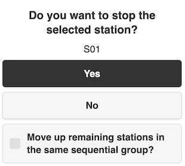{ .img-border .img-shadow width="150" style="float: right; margin: 5px 5px 5px 5px;"}
To **stop** a zone that's currently running or queued, click its zone card and confirm.
If there are other queued zones in the **same sequential group**, a **"Move up remaining stations"** checkbox appears to let you choose if you want all remaining zones in that group to shift up, so the next one starts immediately instead of waiting for its original scheduled time.

---

#### Change Rain Delay

Use **Change Rain Delay** in the Footer Menu to set a custom rain delay (in hours). Affected zones stop immediately and remain off until the delay expires. To cancel an active rain delay: click the status bar at the footer, or set a rain delay time of `0`.

---

#### Pause Station Runs

This feature temporarily halts all active and queued zones:

* Running zones stop immediately and automatically resume when the pause timer reaches 0.
* Start times for queued zones shift accordingly.
* Programs whose start time falls within the pause window are queued and delayed until the pause ends.
* During the pause, the footer shows the **Pause Status**.

To **modify or cancel** an active pause:

* Click the status bar in the footer, or
* Use Footer Menu → **Change Pause**.

---

#### Stop All Zones

Immediately terminate all zones and clear the running queue.

### Edit Options

Click Footer Menu → Edit Options (or press `Alt+O`) to configure settings:

#### System Settings

* **Location:** Tap *Location* to open the map and search for your address; or click the pencil icon ✏️ to manually enter the GPS coordinates.
    * **PWS location:** When using **WUnderground (WU)** as the weather data provider, you must select a **Personal Weather Station (PWS)** location.
        1. First enter and submit a valid **WU API key** in the [Weather and Sensors](#weather-adjustment) tab.
        2. Return to the Location setting - available PWS sites will appear as **blue dots** on the map.
        3. Click one of the blue dots as your PWS location.
* **Time Zone:** The timezone and DST are detected automatically based on your Location (via weather queries; requires Internet), thus this dropdown list is grayed out by default.
    * To **override manually**, clear the Location field by tapping the cross icon ✖️ next to it – then the timezone dropdown list becomes editable.
* **Enable Logging:** Stores log data in internal flash memory (enabled by default).
---

#### App Settings

These settings are stored/cached in the app/UI. They do not affect the controller.

* **Use Metric / 24-Hr Time:** Set preferred unit system (imperial or metric) and time format (12-hr or 24-hr). Defaults to automatic detection.
* **Orders Stations by Groups / Names:** Customize how zones are sorted on the homepage (instead of solely by zone indices).
* **Show Disabled:** Toggle visibility of disabled stations and programs.
* **Show Station Number:** Display each zone’s numeric index alongside its name.

---

#### Configure Master

This firmware supports up to **two independent masters**, each configurable as follows:

* **Master Station:** Select a zone to act as a master (pump relay). Any zone can be designated. A master zone activates alongside other zones.
* **Master On Adjustment:** Fine-tune the timing of **master activation** (`−600` to `+600` seconds, in steps of `5` seconds). Examples:
    * `+15` → Master turns on `15` seconds **after** an associated zone starts.
    * `-60` → Master turns on `60` seconds **before** a zone starts.
* **Master Off Adjustment:** Similar to above but for master **deactivation** timing.

---

#### Station Handling

* **Number of Stations:** OpenSprinkler automatically detects the **available zones** (including expanders), but users must manually configure this number - it's allowed to exceed the physical zones to include **Virtual Zones** (see [Station Type](#station-cards)). Default: `8` zones.
* **Station Delay:** Time gap between consecutive zones (`−600` to `+600` s, in 5-second steps). Default: `0` (no delay). Examples:
    * `+60` → The next zone starts `1` minute **after** the previous finishes.
    * `-15` → The next zone starts `15` seconds **before** the previous ends (i.e. the two zones overlap by `15` seconds). Useful for managing water throttling issues.

---

#### Weather Adjustment

* **Adjustment Method:** Select a weather-based adjustment method.
    * **Manual** (default): set **% Watering** manually.
    * Other methods calculate adjustments automatically. Detailed explanations of supported methods are available on [OpenSprinkler Support](https://openthings.freshdesk.com/support/solutions/articles/5000823370).
* **Adjustment Method Options:** Configure parameters for the selected method.
* **Adjust Interval Programs using Multi-Day Average:** This option is available for **Zimmerman or ETo** methods. Enabling it allows **all interval programs** to apply the **average watering level** across the program's interval, rather than just the previous day's. For instance, a program that runs every `4` days uses the 4-day average. For programs that don't run daily, this provides more accurate adjustments that reflect all weather changes since the last run.
    * Applies only if the **Use Weather** flag is enabled for that program.
    * Limited by provider’s historical data (e.g. Apple = `10` days). If the interval length exceeds the available weather data, the maximum available range is used.
    * The array of multi-day averages are shown in **System Diagnostics**.
* **Weather Restrictions:** Available for all adjustment methods (including Manual):
    * **Rain:** Skip watering if **Total Forecast Rain** > a set amount over a user-defined number of days (e.g. `0.5in` in the next `3` days). Setting either value to `0` disables this rule. The forecast capability is limited by your selected weather provider (Apple = `10` days). If the number of forecast days exceeds the data, the maximum available range is used.
    * **Temperature:** Skip watering if **Current Temperature** < a set value (e.g. `50°F` or `10°C`). A value of `-40` (either °F or °C) disables this rule.
    * **California Rule:** Legacy rule that skips watering if `>0.1"` rainfall in the past `48` hours.
    * **Active weather restrictions** appear both on the homepage and in System Diagnostics.

* **Weather Data Provider:** Choose preferred data provider. Default: **Apple**.
    * If the provider requires an API key, a key input box appears.
    * Some providers have region limits (e.g. **DWD** = Germany only; **WU** requires PWS location).
* **% Watering:** Global scaling factor applied to water times. Default: `100%`.
    * Editable only for **Manual** adjustment method (as others calculate this automatically).
    * Example: `75%` → Multiply all station water times by 0.75.
    * Applies only to programs where the **Use Weather** flag is enabled.

---

#### Sensor Setup

OpenSprinkler supports **two independent sensors** (`SN1`, `SN2`) with configurable types: **Rain**, **Soil** (binary output only), **Program Switch**, and **Flow** (*currently only supported on `SN1`*).

* **Connections:**
    * The sensor's **two signal wires** should be connected to **SN1 + GND** (or **SN2 + GND**).
    * Do **<u>NOT</u>** connect any signal wire to **COM** as it may damage the controller.
    * **If the sensor needs +5V** power (e.g. certain flow sensors), use **+5V** (VIN) port to supply it.
    * **If the sensor needs 24VAC** power (e.g. wireless sensors), connect its **power wires** to **COM** and **GND** (AC-powered model only; DC/Latch models can NOT provide 24VAC).
    * For OpenSprinkler v3.4: `SN3`, `SN4` are reserved for future use and not enabled currently.

* **Rain / Soil Sensor:** Automatically stop zone runs when rain or high soil moisture detected.
    * Choose **Normally Open** or **Normally Closed** (most common type).
    * Only support sensors that output **binary ON/OFF signals** (dry-contact switches).
        * For **Analog Sensors**, use an [**Analog-to-Digital Adapter**](https://opensprinkler.com/product/a2dadapter/), which converts an analog signal to ON/OFF with an adjustable threshold.
    * **Delayed On:** Time sensor must remain active before trigger (prevents false triggers).
    * **Delayed Off:** Hold time after sensor deactivation (prolongs sensor hold). Examples: 
     10-minute Delayed On → Sensor regarded as triggered after it's active for 10 minutes. 
     30-minute Delayed Off → Sensor regarded as deactivated after it's inactive for 30 minutes. 
* **Program Switch:** Use a dry-contact switch / button to start a program.
    * `SN1`: Starts `Program 1`
    * `SN2`: Starts `Program 2`
    * Activated if the switch / button is pressed for more than 1 second.
* **Flow Sensor:** Detect flow pulses to measure **real-time flow rate** and **log total flow volume** at the end of each station run and program cycle.
    * Support all **dry-contact, 2-wire** flow sensors (recommended). 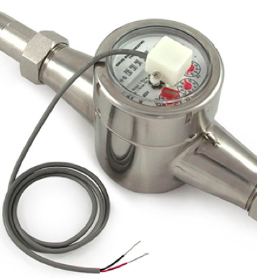{ .img-shadow width="150" style="float: right; margin: 5px 5px 5px 5px;"}
        * Connect the two wires to **SN1 + GND**.
        * They are essentially reed switches that open and close repeatedly as water flows through the meter. They do not need power and the two wires have no polarity.
    * Also support **3-wire** flow sensors that work with **+5V**.
        * Wiring: `GND`(black) to `GND`, `5V`(red) to `+5V` (VIN), Data (yellow) to `SN1`.
    * **Flow Pulse Rate:** can be found in the flow sensor datasheet.
        * Used to convert flow pulse count to actual water volume.
        * Precision is limited to **2 decimal places** (additional decimals discarded).
        * If higher precision is needed, scale the rate by a factor of `10`.
        * Recommend keeping `L/pulse` as the unit (even if the datasheet specifies Gallon/pulse) - the unit is for display only.
    * Due to software implementation, the flow **click frequency** should **NOT** exceed `50Hz`, as higher frequencies may lead to inaccuracies.

---

#### Integration

* **OTC:** Configure **OpenThings Cloud (OTC)** token for remote access. See [**OTC Support Article**](https://openthings.freshdesk.com/support/solutions/articles/5000879535).
* **MQTT:** Configure MQTT parameters. See [**MQTT Support Article**](https://openthings.freshdesk.com/support/solutions/articles/5000859089).
* **Email Notifications:** Configure Email settings. See [**Email Notifications Support Article**](https://openthings.freshdesk.com/support/solutions/articles/5000889759).
* **IFTTT:** Configure IFTTT Webhooks key. See [**IFTTT Support Article**](https://openthings.freshdesk.com/support/solutions/articles/5000716372).
* **Notification Events:** Select events that trigger MQTT/Email/IFTTT notifications.

    !!! warning "Avoid Too Many Events"
        Enabling too many events or notification methods may cause significant delays, missed responses, or even skipped short water cycles.

* **Device Name:** A custom name for this controller, shown on the homepage and included in notifications messages, to help identify the controller.

---

#### LCD Screen

* **Idle Brightness:** Set the LCD brightness when the controller is inactive.
    * Lowering it helps extend the LCD's lifespan.
    * Set to `0` will turn off the LCD completely when inactive.
    * Pressing any button reactivates the LCD.

---

#### Advanced Settings

* **HTTP Port:** Change the device's HTTP port. Default: `80`.
* **Undercurrent Threshold:** Triggers Undercurrent notification if a zone’s current draw (`mA`) falls below this value at the end of its run (e.g., broken wire or faulty solenoid). Default: `100 mA`.
    * The ideal value is half the typical holding current of your solenoid.
    * Set to `0` to disable this detection.
* **Overcurrent Limit:** Triggers Overcurrent Alert if the current draw (`mA`) **at any time** exceeds this value (e.g. due to shorted solenoids, faulty wiring, or too many zones running concurrently).
    * If detected upon starting a zone, **the affected zone shuts off** immediately.
    * If detected mid-run (i.e. system overcurrent), **all active zones shut off** immediately.
    * The alert appears on LCD, UI/App, and is sent to all enabled notification channels.
    * Once tripped, the controller can continue running programs and zones (as long as they don’t trigger overcurrent again), but the alert persists until it's cleared (by clicking the status bar message), or when the controller is rebooted.  
    * Set to `0` to use the system default.
    * Set to `2550` (max) to disable this feature (**NOT recommended** as disabling it exposes the controller to potential overcurrent damage).
    * To diagnose the cause of overcurrent, perform a [**Solenoid Resistance Test**](../troubleshooting.md#wiring-and-solenoids).
    * This feature is only available on AC/DC-powered OpenSprinkler v2.3 & v3.x (other controllers like OSPi lack current-sensing capability).
* **Boost Time (DC/Latch models only):** Voltage-boost duration (`0-1000ms`). Default: `320ms`.
    * Increase when using a weak/low-current DC adapter that takes more time to boost voltage.
* **Target PD Voltage (DC v3.4 only):** Set the desired USB-C PD (Power Delivery) voltage.
    * Set to `0` to use the system default.
    * The **ideal value** is your solenoid's **holding current** multiplied by its **coil resistance** (e.g. `0.25 A × 30 Ω = 7.5 V`). The **holding current** is listed in the solenoid's datasheet; the **coil resistance** can be measured using a multimeter.
    * This option is shown only when the power supply supports PD, PPS, or AVS.
    * The **Actual Voltage** (shown beneath the option name) is the closest supported voltage your adapter can provide to match the target value. 
* **Latch On/Off Voltages (Latch model only):** Customize boost voltages for activating and deactivating latching solenoids. Maximum: `24V`. 
* **NTP IP Address:** Custom NTP server for time sync. Set to `0.0.0.0` to use system defaults.
* **Ignore Password:** When enabled, accepts any device password (i.e. bypass password).
* **Special Station Auto-Refresh:** Periodically resends commands to Virtual Stations (RF/Remote/HTTP) to keep them synchronized with the main controller.
* **NTP Sync:** Automatically syncs device time based on your Location.
    * To **manually adjust time**, disable this option, then the Device Time becomes editable. 
* **Use DHCP:** Automatically obtains IP from your router using DHCP.
    * **Recommend keeping this option enabled**.
    * If **fixed IP assignment** is preferred, use your router’s **DHCP reservation** (IP-to-Mac binding). Disable DHCP only if your router doesn't support DHCP reservation.
    * If disabled, you MUST manually enter a **Static IP**, along with **Gateway, Subnet, DNS**. **All must be set correctly** for the controller to function properly.

---

#### Reset

* **Clear Log Data:** Erase all stored logs.
* **Reset All Options:** Restore all options back to factory defaults.
* **Delete All Programs:** Erase all programs.
* **Reset Station Attributes:** Restore all station settings to factory defaults.
* **Reset Wireless** (v3 only): Reset to WiFi AP mode for re-configuring WiFi.

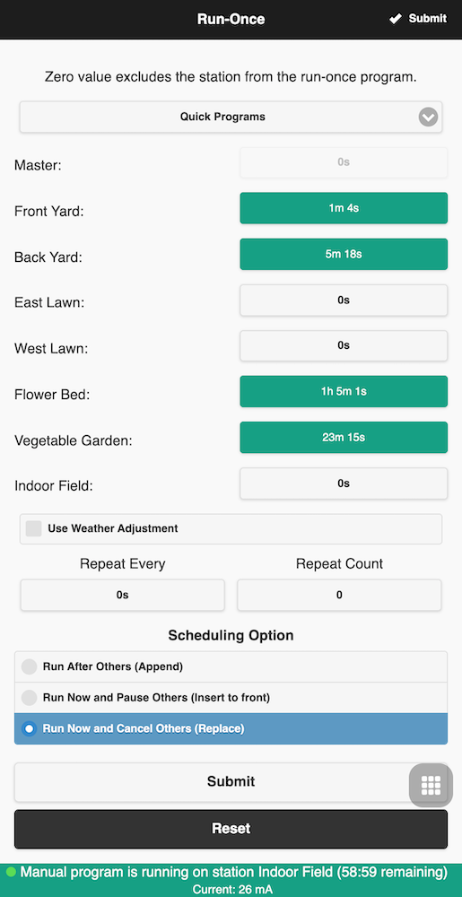{ .img-border .img-shadow width="250" style="float: right; margin: 5px 5px 5px 5px;"}

### Run-Once Program

Use Footer Menu -> **Run-Once Program** (`Alt+R`) to manually start a **one-time** program. Here you can load preset run times from an existing program, quickly build a test program, or manually enter the run time for each station.

* All relevant station attributes are applied (e.g. **Use Master**, **Sequential Group**, **Station Delay**, **Master On/Off Adjust**).
* Choose whether to apply the current **% Watering**.
* If you set the program to **Repeat**, the system auto-creates a [**Single-Run Program**](#programs).
* If zones are already running, a **Scheduling Option** appears to let you choose how to queue the new program:
    * **Append:** Run after existing zones
    * **Insert to Front:** Run now and **pause** others
    * **Replace:** Run now and **cancel** others

**Tip 1 - Start a Program using Controller Buttons**
 If you need to grant someone controller access without WiFi, you can start a program on the controller **using its buttons**: Press and hold **B3** until **Run a Program** appears, tap **B3** to navigate through available programs, then press and hold **B3** to start it.

**Tip 2 - Create a Manual-Only Program**
 You can create a program that won't run on its own but remains available for Run-Once Program and via button activation. To do so: [Create a new program](#programs) and set it as **Disabled**.

### Programs

OpenSprinkler supports up to **40 programs**. Use Footer Menu -> **Edit Programs** (`Alt+P`) to access the program list. From here you can: **Add**, **Modify**, **Copy**, **Delete**, **Run Manually**, or **Reorder** programs (using the arrow ⬆️ icon).

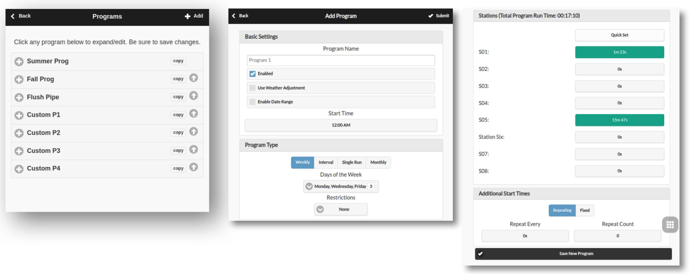

#### Program Data

Click **Add** ➕ in the upper-right corner to create a new program. Each program includes:

**Basic Settings:**

* **Program Name:** Up to 32 characters. (See [Program Name Annotations](#program-name-annotations) for supported suffixes).
* **Enabled:** Enable/disable the program.
* **Use Weather Adjustment:** Apply weather-based adjustments, including current **% Watering**, **Weather Restrictions**, and **Multi-day Averaging** (for Interval programs only).
* **Enable Date Range:** Restrict program operation to a date range. Examples:
    * `05/15-09/15`: May 15 to Sep 15.
    * `11/10-02/20`: Nov 10 to Feb 20 (of the following year).
* **Start Time:** The first start time (e.g. `8:15 AM`). It also supports using **Sunrise** or **Sunset** times with optional offsets.

**Program Type:**

* **Weekly:** Run on selected **weekdays**.
* **Interval:** Run **every `N` days** (`1-128`).
    * **Starting in:** the offset relative to today: `0` = today, `1` = tomorrow, up to `N-1`.
    * **Multi-day Average** watering level applies to this type.
* **Single-Run:** A **one-time** program that **auto-deletes** itself after completion.
* **Monthly:** Run on a specific day of **each month**: `1` = 1st day, `0` = last day.
* **Restrictions:**
    * **Odd-day:** Run only on odd-numbered days (skips the 31st and Feb 29th).
    * **Even-day:** Run only on even-numbered days.

**Station Water Times:** Set run time per station, from `1` second to `64800` seconds (18 hours). Also supports using **sunrise-to-sunset** or **sunset-to-sunrise** duration as the run time.

**Additional Start Times:** Two options for extra start times / cycles:

* **Fixed:** Up to 3 extra cycles at any specified times of the day.
* **Repeating:** Repeat at regular intervals (e.g. every 45 minutes for 8 extra cycles). Useful for splitting long watering durations into shorter cycles (*cycle and soak*). 
Repeating start times may also extend overnight into the next day.

---

#### Program Name Annotations

Program names can include annotations to customize station run order or trigger special actions.

**Station Order Annotation** By default a program runs stations in ascending order by index (from lowest to highest). To change this behavior, append the program name with a `>` followed by one of the following letters. 

* `I`: Descending by station index (highest to lowest)
* `n`: Ascending by station name
* `N`: Descending by station name
* `r`: Random order
* `a`: Alternate ascending/descending by index
* `A`: Alternate descending/ascending by index
* `t`: Alternate ascending/descending by name
* `T`: Alternate descending/ascending by name

Example: A program named `Summer Garden >t` runs stations by ascending name order the first time, descending the next, and alternates each run thereafter.

The [**Program Preview**](#program-preview) reflects all name annotations, allowing easy verification of intended run order. **Manual program runs** also honor these annotations.

**Reboot Annotation:** Special program names to trigger automatic reboots at regular intervals:

* `:>reboot`: Reboot when the controller becomes idle (no zones running).
* `:>reboot_now` Immediate reboot, regardless of zone activity.

Both actions are **delayed by one minute** from the scheduled start time to prevent immediate retriggering right after the reboot. At least one zone with a non-zero duration must be included when creating the program, though it will not actually run any zones. Example: a program named `:>reboot` starting daily at `2:00 AM` will reboot the controller at that time each day. 

---

#### Program Preview

To verify all programs are set correctly, use Menu -> **Preview Programs** to visualize them.

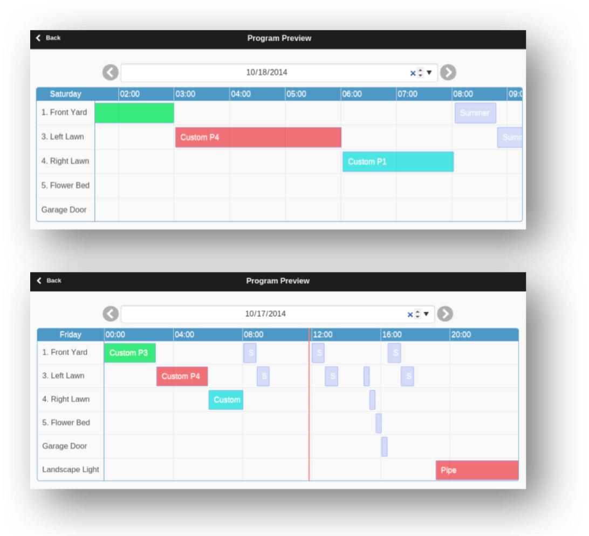{: .center_wider}

* **Today’s schedule** is shown by default; use the arrows ⬅️ / ➡️ to browse other days.
* **Current time** is shown as a pink vertical line. You can **zoom** or **drag** the plot to view different time windows.
* **Colored bars** represent each station's runtime and program name; clicking a bar opens the corresponding program editor.

**Simulation Accuracy:** The preview uses a simulation of the same scheduling algorithm as the controller firmware, fully accounting for settings such as **Master Zones**, **Station Delay**, **Master On/Off Adjustments**, and **Sequential Groups**.

**Weather & Dynamic Events:**

* **Rain Delay** and **Sensors** are ignored (they rely on real-time conditions).
* Programs set to **Use Weather Adjustment** scale according to the current **% Watering**:
    * **Manual:** The same **% Watering** applies to all preview days.
    * **Zimmerman/ETo:** The current **% Watering** applies only to **today**; all other days assume 100% (they rely on real-time conditions not predictable in advance).
    * **Weather Restrictions** and **Multi-day Averages** apply only to **today**'s schedule.
    * If **% Watering < 20%**, stations with calculated runtime **under 10 seconds** are skipped to avoid very short watering periods (matching firmware behavior).

----

#### Zone's Group Attribute

OpenSprinkler supports both **Sequential** (one after another) and **Parallel** (concurrent) zone operations, managed by each zone’s **Sequential Group** attribute.

* Zones in the **same Sequential Group** run sequentially (one at a time). If a zone is scheduled to start while another zone in the same group is already running, it will be automatically queued. This is the most common method used in most sprinkler controllers, to maintain water pressure by preventing multiple zones from running at the same time.

* Zones in **different Sequential Groups** can run simultaneously (in parallel).
Example: If Zones 1–3 are in Group `A`, and 4–6 in Group `B`, they can operate in parallel.

* **Parallel Group:** Runs independently of all other zones, useful for lights, pumps, heaters or other non-sprinkler devices (which can run in parallel).

<u>**NOTE**</u>: **Earlier firmwares** used a single **Sequential flag** for all zones, which effectively put all zones in a single sequential group. That flag has been replaced by the multi-group system here, which provides greater flexibility by allowing multiple independent groups.

### Logs

OpenSprinkler supports logging, which records **Zone Activity**, **Rain Delays**, **Sensor Events**, **Flow Volumes**, and **% Watering Changes** to its internal flash. To view logs:

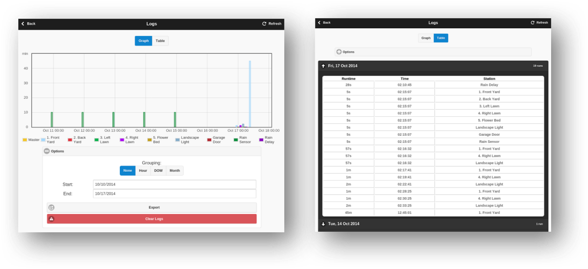

* Use Footer Menu → **View Logs** (`Alt+L`) to display a graph of recorded data.
* Use the **Options** tab to select a start and end date (default: last 7 days).
 For large datasets or slow loading, limit the range to a single day.
* Click **Table** at the top to switch to a tabular view.

For details on the log data format and example scripts to export logs (e.g. as spreadsheets), refer to the [OpenSprinkler API documentation](221_4_api.md#18-get-log-data-jl).

### Firmware Update

Follow the [firmware update instructions](../index.md#firmware-update).

### Links and Resources

* [OpenSprinkler Homepage](https://opensprinkler.com/)
* [OpenSprinkler Support Site](https://support.opensprinkler.com/)
* [OpenSprinkler Documentation](https://opensprinkler.github.io/OpenSprinkler-Firmware/)
* [OpenSprinkler Github](https://github.com/opensprinkler)

### Specifications

|                   | OpenSprinkler v3 | OpenSprinkler Pi (OSPi) |
|:------------------|:-----------------|:------------------------|
|**Input Voltage:** | **AC** model: 22-28V **AC** **DC/Latch**: 6V-24V **DC** | 22-28V **AC** |
|**Power Draw:**    |0.5-0.9 W         |0.5 W + RPi's Power Draw |
|**Num. of Zones:** |Main controller: 8; Expandable to 72|Main controller: 8; Expandable to 200|
|**Solenoid Driver:**|**AC**: 1 A/zone (triac) **DC**: 2 A/zone (MOSFET) **Latch**: 6A instant/zone|1 A/zone (triac)|
|**Dimensions:**    | **v3.0-3.3**: 140×56×33 mm **v3.4**: 125×79×25 mm|135×105×38 mm|
|**Weight:**        | 140 g (5 oz) | 200 g (7 oz) |
|**Expander:**      | 130×75×25 mm / 100 g (4 oz) | 130×75×25 mm / 100 g (4 oz) |

### Advanced Topics

#### Installing RF Transmitter

OpenSprinkler supports standard 434 MHz and 315 MHz **RF (Radio Frequency) transmitters**, allowing it to control remote power sockets for switched powerline devices such as lights, heaters, fans, and pumps. To use RF stations:

* Use an [**RFToy**](https://opensprinkler.com/product/rftoy/) to capture and decode the signals from your remote power sockets.
* Each RF code is a hexadecimal string: either 25-digit (e.g. `H00003C0300003C3301490118`) or 16-digit (e.g. `51001A0100BA00AA`), that encodes the on/off commands and timing data.
* The RFToy kit includes both 433 MHz and 315 MHz transmitter/receiver pairs — select the one that matches your remote sockets. For best range, solder a `17 cm` wire antenna to the `ANT` pin on the transmitter (straight or coiled).

**Connecting the RF Transmitter:**

* **OpenSprinkler v3 / OSPi v2:** Have a built-in **3-pin RF header**. Plug the RF transmitter directly into this header, with **component side up** (see [Hardware Interface Diagram](#hardware-interface)).
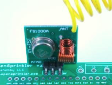{ .img-border .img-shadow width="180" style="float: right; margin: 5px 5px 5px 5px;"}
* **OSPi v1:** No dedicated shrouded header, but `DATA/VIN/GND` pads are available on the PCB for soldering the transmitter to these pins.

For detailed setup steps and examples, see the [RF Station blog post](https://opensprinkler.com/opensprinkler-firmware-2-1-1-new-feature-control-remote-power-sockets/).

 

