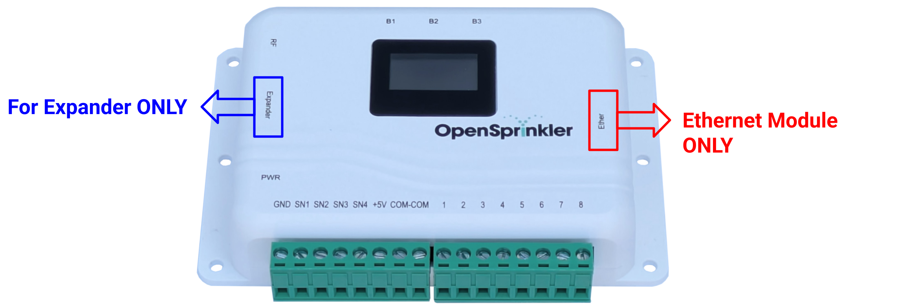

## Troubleshooting Instructions

!!! note
    This page covers the most common troubleshooting steps. For additional technical support, visit the [Support Portal](https://support.openthings.io) or the [Community Forums](https://opensprinkler.com/forums/). Before submitting a support ticket, make sure you have carefully read the [User Manual](https://opensprinkler.github.io/OpenSprinkler-Firmware/2.2.1/221_4_manual/), [FAQs](https://opensprinkler.github.io/OpenSprinkler-Firmware/faq/), and common issues listed on this page.

### Identify Your Hardware & Firmware

Before seeking support, you must identify your OpenSprinkler's hardware and firmware versions.

**Find your Hardware Version**

* **From App/Web UI:** At the homepage, swipe left to right to open the side menu. Tap **About**; you will see the hardware version listed there.
* **During Reboot:** Power cycle the controller; the hardware version is briefly shown on the LCD during booting.
* **Check Label:** The back panel of your controller usually has a label showing the version.
* **Otherwise:** Check your order details, attach a clear photo of your controller in a support ticket.

---

**Find your Firmware Version**

* **From App/Web UI:** At the homepage, swipe left to right to open the side menu. Tap **About**, you will see the firmware version listed there.
* **During Reboot:** Power cycle the controller; the firmware version is briefly shown on the LCD during booting.

---

**Understanding Hardware, Firmware, and App Versions**

The **About** page shows three different version numbers:

* **Hardware** refers to the physical version. Example: `v3.3`, `OSPi`. The only way to upgrade hardware is to buy a new controller.
* **Firmware** refers to the software running on the controller. Example: `2.2.1(3)`. It consists of a **dotted version** (e.g. `2.2.1`) and **build number** in parentheses. Firmware can be updated, though it is not automatic: you must manually upload a new firmware to it.
* **App** refers to the mobile app or web UI running on your phone or browser. Example: `2.4.90`. The app/UI updates automatically on your phone when a new release is available.

### Wiring and Solenoids

**Solenoid Resistance Test**

Before powering on the system for the first time, please perform a solenoid resistance test. This test can quickly and effectively determine if a problem is with faulty solenoids and wiring. You will need a **multimeter** set to measure **Resistance** (Ω).

1. Power off the system. Do **NOT** measure resistance when the system is alive.
2. Measure the resistance between the **COM** (common) wire and **each zone** wire individually.
3. Check results:
    * A **Normal** 24VAC solenoid should measure 20-60 Ω.
    * **Very low** resistance (~0 Ω) indicates a shorted solenoid or wiring.
    * **Very high** resistance (>1000 Ω) indicates a burnt-out solenoid or broken wire.
    * **Low but not 0** resistance (4-10 Ω) indicates Latching solenoid valves. You should confirm by checking the valve body to see if there is any 'Latch/Latching' label.
---

**AC voltage is present between COM and a zone even when that zone is OFF.**

If there is no load (i.e. solenoid) connected to the controller, it's normal to measure **stray (floating) voltage**, even when no zone is turned on. This does **NOT** indicate a faulty controller. The stray voltage disappears once solenoids are connected.

---

**Multiple zones turn on as soon as power is applied.**

You likely used a **DC adapter** on an **AC-powered** controller. AC models require an **AC output** adapter: check the adapter label to see if it specifies **AC** on the output voltage (e.g. 24V**AC**). If unsure, verify with a multimeter. 

---

**Zones can turn on but won’t turn off unless power is removed.**

Same root cause as above: you likely used a **DC adapter** on an **AC-powered** unit.

---

**None of my zones turns on, or the current draw is very low (e.g. <100mA).**

* Check if the controller still powers on (e.g. if the LCD displays anything). If not, the power adapter may be dead and need to be replaced. Verify with a multimeter.
* Double-check the **COM** (common) wire - a loose or broken COM wire prevents all zones from activating.
* Inspect the **fuse** inside the controller: unplug power, open the enclosure, and inspect the fuse on the lower-left of the circuit board. If the fuse is burnt, replace it with a similar rating.
* Generally, a broken fuse indicates a shorted solenoid, wiring, or opening too many zones at the same time. Perform a [solenoid resistance test](#wiring-and-solenoids) right away.

---

**Some zones can turn on but others won't.**

First, perform a [solenoid resistance test](#wiring-and-solenoids) to rule out solenoid or wiring faults. If readings are normal, open the controller enclosure, take a clear photo of the PCB, and check for visible damage (burn marks/discoloration, bulged components). If you’re unsure, open a support ticket and attach the photo — include your hardware/firmware versions and describe the symptoms.

### Power and Expander

**My controller doesn't power on.**

If the controller no longer powers on (and the LCD displays nothing), follow these steps:

1. **Disconnect everything:** Unplug power and remove all peripherals (expanders, wired Ethernet module, sensors).
2. **Check the power adapter:** Use a multimeter to check the output of your power adapter. For example, a 24VAC power adapter should output an **AC** voltage about 24-30V; a 7.5VDC adapter should output a DC voltage of 7.5V. If it reads 0 or very low, replace it.
3. **Visual inspection**: Open the enclosure, visually inspect the components. Check the fuse, and visible damage (burn marks/discoloration, bulged components).
4. **Contact support:** If the adapter is good and there is no visual damage, plug in power again (but keep all other peripherals disconnected for now). If the problem persists, submit a support ticket and attach a clear, well-lit photo of the circuit board.

---

**After connecting an expander, the controller no longer powers on.**

This happens when the expander is accidentally plugged into the **wired Ethernet module** header instead of the **Expander** header. Please **unplug power immediately**, remove the expander, and plug it into the correct connector, marked 'Expander'. See the diagram below.

---

**The expander isn't recognized by the controller.**

1. **Check expander connection:** is it plugged into the correct port (see the question above)?
2. **Reboot the controller** to allow it to re-detect expanders.
3. **Verify in the UI:** Go to the controller's homepage → Edit Options → Station Handling. Under **Number of Stations**, it shows the total available stations (including those on expanders):
    * If it shows more than `8` available, the expanders are detected. Proceed to **choose how many you want enabled** using the dropdown list.
    * Otherwise, the ribbon cable or expander itself may be faulty - submit a support ticket and ask for a replacement.

---

**I don't see any expanded zones.**

First confirm the expander is detected (see the question above). Note that detection does **not** auto-enable expanded zones. You need to manually choose how many to enable using the dropdown list.  

---

**The expander is recognized, but zones on the expander don't work.**

1. **Confirm detection:** Follow the questions above to verify the expander is detected.
2. **Check the COM (common) wire:** All zones including expanded must have a common wire that goes to the COM terminal on the main controller. A missing/broken COM wire will cause zones to stop working.
3. **Perform a [solenoid resistance test](#wiring-and-solenoids)** to rule out solenoid and wiring issues.
4. **Check zones on the main controller:** If the first eight zones exhibit the same issue, this is likely due to a broken fuse/COM wire; otherwise, it's more likely an expander-specific issue.

---

**How do I connect multiple expanders?**

* **Power off the main controller:** Always remove power before adding/removing expanders.
* **Daisy-chain expanders:** Use the included ribbon cable to link the next expander to the previous.
* **Set a unique DIP index:** Each expander **must have a unique index**. The DIP switch is at the back of the expander. Follow the instructions there. If two expanders have the same index, the main controller can't tell them apart. 
* **Power on and verify:** Follow the questions above to verify all expanders are detected.

---

**I have multiple expanders, some work, others don't.**

* **Check DIP switch:** as described above. Every expander must have a unique DIP index. 
* **Test one at a time:** Power off; remove all expanders; connect only one; power on, and verify it's detected and its zones work. Repeat for each additional expander. This helps isolate the bad expander/cable.

### Reset and Configurations

**What's the default device password?**

After a factory reset, the default password is `opendoor`. There is NO username. This password is for accessing OpenSprinkler's homepage / UI. It's **NOT** your `opensprinkler.com` login credential, nor your WiFi password. For security, please change this password after your first login.

---

**I forgot the device password. How do I regain access to the controller?**

You can use buttons on the controller to bypass the device password. To do so:

* Reboot the controller; as soon as the OpenSprinkler logo appears, press and hold pushbutton **B3** until the LCD shows **Setup Options**.
* Click B3 repeatedly until it gets to **Ignore Password**. Click B1/B2 to select **Yes**.
* Hold B3 until the controller reboots. Now you can log in with any password (or blank).
* For security, change the password after logging in, and reset the **Ignore Password** option to No.

---

**I changed my WiFi router/SSID/password. How do I reset WiFi?**

**Reset to AP (Access Point) mode**: hold **B3**, then press **B2** within 1-2 seconds (similar to pressing Ctrl+C on a keyboard). Confirm on the LCD when prompted. The unit will reboot into AP mode. Follow the [WiFi Configuration step](2.2.1/221_4_manual.md#step-4-setting-up-wifi-ethernet) in the user manual.

If Reset to AP doesn't work, perform a Factory Reset (see below).

---

**How to perform a factory reset?**

!!! warning
    A factory reset erases all programs, settings, logs, and data. If you can still access the controller, export a copy of your current configurations (see below) to easily restore them afterwards.

* Reboot the controller; as soon as the OpenSprinkler logo appears, press and hold **B1** until the LCD shows **Factory Reset?**.
* Verify the answer is **Yes**.
* Press and hold B3 until the controller reboots and completes the reset.
* After reset, the default device password is `opendoor`. WiFi is in AP mode.

If your controller is OSPi, see [OSPi-specific instructions](#ospi-specific).

---

**How do I save the configurations?**

!!! info
    Regular exports make it easy to restore programs and settings later. They’re also helpful to attach when opening a support ticket so we can reproduce software-related issues.

At the controller's homepage, swipe left to right (or tap the upper-left menu icon) to open the side menu, then tap **Export Configurations** to a file.

--- 

**I get a blank page when accessing the controller. How do I save the configurations?**

See [Blank page troubleshooting](#ui-app-time-and-lcd) below. In Step 4, use the `/ja` endpoint to fetch your settings directly, and save them as a file.

### Connectivity

**WiFi connection issues**

If your OpenSprinkler v3.x fails to join or stay connected to your WiFi network, try these steps:

1. **Check the mode:** Is the controller still in **AP** (Access Point) mode (LCD shows 4 lines, with a fast-blinking dot)? If so, follow WiFi Configuration in the user manual.
2. **Changed router/SSID/password recently?** Follow the [Reset WiFi](#reset-and-configurations) instructions above. 
3. **Router compatibility checklist:**
    * **2.4 GHz only:** The controller's ESP8266 chip is compatible with 2.4 GHz only. Make sure your router has 2.4 GHz enabled and uses a different SSID than 5 GHz.
    * **Security:** Use **WPA2-PSK (AES)** or WPA2/WPA mixed. **Avoid WPA3-only** and **Enterprise**.
    * **Radio mode:** Set 2.4 GHz to Wi-Fi mode to **b/g/n (no ax)**.
    * **Channeling:** **20 MHz** width; prefer channels **1/6/11**.
    * **Band steering:** **Disable** band steering / Smart Connect.
    * **PMF/802.11w** (if applicable): Set to **Optional (not Required)**.
    * **Isolation/filters:** **Disable AP isolation**, **MAC filtering**, and **captive portal** requirements.
    * Turn on **legacy mode** on 2.4 GHz, **disable WMM and airtime fairness**.
    * Ensure the controller isn’t blocked by firewall rules.
4. **Additional troubleshooting:** If problems persist, there may be an ad-hoc compatibility issue between ESP8266 and your router. Try:
    * A different WiFi network (e.g. your phone's 2.4 GHz hotspot) to see if it works.
    * Look up your router model + `ESP8266` for known issues and fixes. For example, if your router is Asus BE7200, search (or use generative AI) `ESP8266 issues Asus BE7200`.
5. **Use wired Ethernet:** Use a [wired Ethernet module](https://opensprinkler.com/product/wired_ethernet/) to bypass WiFi entirely.

**<u>For OSPi</u>:** Wi-Fi is managed by the Raspberry Pi. Ensure adequate Pi power (OSPi supplies up to 500 mA. RPi 3/4/5 may need extra power via USB, otherwise WiFi may be unstable). 

---

**Wired Ethernet connection issues**

If your controller can't connect or stay connected via wired Ethernet, try these steps: 

1. **Check the LEDs:** On your controller's RJ-45 jack, one LED should be solid (link), and the other blinks on traffic. If not, try a known-good cable and different router/switch port.
2. **Disable PoE** (Power-over-Ethernet) on that port: OpenSprinkler’s wired module is **not PoE-compatible**. PoE-enabled port can cause it to malfunction.
3. **DHCP Setting:** Leave the controller on DHCP, and set a **DHCP reservation** (IP-to-Mac) on your router to assign it a fixed IP. If you must use Static IP, verify **Gateway IP, DNS, Subnet Mask** are all correct and compatible with your router settings.
4. **Use a dedicated router:** If your wired network is very busy, the most effective solution is to place OpenSprinkler on a dedicated router to isolate it from heavy traffic. 
5. **Set an auto-reboot program:** If the controller connects initially but doesn't stay connected, a work-around is to set an auto-reboot program (daily or any regular interval of your choice). See [Program Name Annotation](2.2.1/221_4_manual.md#program-name-annotations) in the user manual.

**<u>For OSPi</u>:** Networking is managed by RPi. Ensure RPi has adequate power (OSPi supplies up to 500 mA. RPi 3/4/5 may need extra power via USB, otherwise network may be unstable).

---

**I can access the controller on my local network, but not when I am away.**

Remote access requires using an **OpenThings Cloud (OTC) token**. To check OTC status, from the homepage, swipe left to right to open the side menu, tap **System Diagnostics**. Make sure OTC status is **Connected**. In the OpenSprinkler mobile app, use the OTC token (instead of the controller's IP address) for remote access.

### UI, App, Time, and LCD

**Blank page when opening the controller's homepage**

1. **Firmware too old:** If your controller's firmware is **older than `2.2.0`**, update to the latest. Older firmwares can't parse newer weather data format, causing corruption and blank homepage. See [firmware update instructions](index.md#firmware-update).
2. **Check for errors:** On a desktop/laptop, open a browser window, turn on **Developer Console** (e.g. in Chrome, go to **Settings** → **More Tools** → **Developer Tools** → click the **Console** tab). Open the controller's homepage and note any errors in the console window.
3. **Reset UI Source:** If you used a custom UI, reset it to the default: visit `http://os-ip/su` where `os-ip` is your controller's IP address. Reset the `UI Source` to the default.
4. **Diagnose with API test script:** [Download the API test script](assets/scripts/TestOSAPI220.html){: download="TestOSAPI220.html" }. Open it in a browser, test your controller with the `/ja` (JSON All) endpoint. If you see an **INVALID JSON** error, the stored data is corrupted, which is why the homepage hangs.
5. **Fix corruption:** Inspect the JSON data (or use a JSON validator) to identify the corrupted fields/variables. Correct the malformed value, save, and import the corrected `.json` as configurations to your controller. This should restore the homepage.
6. **Factory reset:** If you can't repair the data, perform a [factory reset](#reset-and-configurations).

---

**New program or changes to existing programs won't save.**

This is typically an issue with older firmwares. Update your firmware to the latest.

---

**Sequential flag missing after updating to firmware 2.2.0**

Starting with firmware 2.2.0, the old **Sequential** flag is replaced by a more flexible, zone-level **Sequential Group** attribute:

* Each zone can be assigned to **one of four Sequential groups** or to the **Parallel** group.
* Putting a zone in **Parallel** group is equivalent to removing the **Sequential** flag in older firmwares.

For details, refer to the [Firmware User Manual](2.2.1/221_4_manual.md#zones-group-attribute) and the [Video Tutorial](https://openthings.freshdesk.com/support/solutions/articles/5000860920-videos-introduction-to-opensprinkler-v3).

---

**I am getting an error when accessing the logs.**

This happens if the requested log data is excessively large, or a corruption exists in the data.

* **Limit to one day:** On the **Logs** page, open the **Table** tab → expand **Options** → set the `Start` and `End` to the same date. See if the log data loads.
* **Fetch the raw data:** [Download the log helper script](assets/scripts/TestOSLogWithCSV.html){: download="TestOSLogWithCSV.html" } and open it in a browser to retrieve logs directly. This often helps when the standard UI can't render the data due to a corruption.

---

**The time on my controller is wrong.**

OpenSprinkler sets time automatically from two data sources: **your location** (for time zone via weather queries) and **NTP** (network time). If the time is incorrect, try:

1. **Check Location & Internet**
    * Homepage → **Edit Options** → **Location**: ensure it's correct.
    * **If using Static IP**, verify **Gateway IP, DNS, Subnet Mask** are all correct.
    * Confirm the controller has Internet access and is not blocked by a firewall.
2. **Set Time Zone Manually** (if needed)
    * An incorrect time zone is often caused by failed weather queries, and should be fixed by re-checking Location and Internet connection first.
    * To set time zone manually, click the ✖️ icon next to **Location** to clear it. The **Timezone** dropdown is now editable - select the correct timezone and save.
3. **Check NTP Settings**
    * Homepage → **Edit Options** → **Advanced**: ensure **NTP Sync** is enabled.
    * **NTP server:** The recommended default setting is `0.0.0.0` (auto-selects public NTP servers). If using a custom server, confirm it’s valid/reachable.
4. **No Internet? Set Time Manually**
    * If using the controller without Internet, go to **Edit Options** → **Advanced**: **uncheck NTP Sync**.
    * **Device Time** is now editable. Set it, and Save. Note that time will drift without NTP sync.

**<u>For OSPi</u>:** only Steps 1 & 2 apply, as NTP is managed by Raspbian, not by OpenSprinkler firmware.

---

**My zones run at the wrong time.**

Refer to the steps above to verify the controller's time is correct.

---

**A zone runs even though Rain Delay or Rain Sensor is active.**

This is usually caused by that zone being set to `Ignore Rain` or `Ignore Sensor`. These attributes can be found by clicking the ⚙️ icon next to the zone to open its attribute dialog. 

---

**My program didn't run as scheduled.**

* Check if the program's **Enabled** flag is on.
* Check if the controller's **time is correct**.
* Check for any active **Rain Delay** or **Rain Sensor**.
* If the program's **Use Weather** flag is on, check if the current **Watering Level** is 0%, or there is any active **Watering Restriction**.
* **Enable a notification method** (Email, MQTT, or IFTTT) and turn on the **Program Start** event - you will be alerted when a program is scheduled but skipped due to 0% Watering Level or active Watering Restriction. 

---

**How do I verify the Weather Adjustment is working?**

From the homepage, swipe left to right to open the side menu, tap **System Diagnostics**. It shows **Weather Service Details** including error message, if any.

---

**How do I save log data as a spreadsheet?**

[Download the log helper script](assets/scripts/TestOSLogWithCSV.html){: download="TestOSLogWithCSV.html" } and open it in a browser to export log data as a `.csv` file.
---

**The LCD is malfunctioning. How do I replace it?**

If you purchased your OpenSprinkler within one year, it’s covered under warranty: submit a support ticket to receive a replacement display at no cost.

If your purchase is out of warranty: replace it with an off-the-shelf module from [Amazon](https://www.amazon.com) or [Aliexpress](https://www.aliexpress.com). For OpenSprinkler v3.x and OSPi v2.x, search `"I2C OLED 0.96"` (the part number is `SSD1315` or `SSD1306`). The pin order must be `GND, VCC, SCL, SDA` (most common type). Do **NOT** use ones with pins ordered VCC, GND, SCL, SDA as that's incompatible.

To replace: power off the controller; open the enclosure; carefully unplug the existing LCD; plug in the new LCD to the same position; power on and verify.

### OSPi Specific

**Firmware compilation errors**

The OpenSprinkler firmware compiles on modern Raspberry Pi OS (Debian Bullseye/Bookworm/Trixie). Most compilation errors come from an out-of-date OS/toolchain. Upgrading your RPi OS should fix the errors. If issues persist, look up the compilation error message on Google or generative AI for suggested fixes.

---

**GPIO errors**

If the firmware runs but shows GPIO errors (or GPIO actions don't work), it's generally a **permission** issue. Verify you are running it as root (`sudo ...`) or grant access to GPIO devices. When running the firmware in Docker, include `--privileged` parameter, or map GPIO devices to Docker.

---

**Power issues**

If the Pi won't power on, or WiFi drops constantly, try these steps:

* **Power off OSPi**, remove peripherals (expanders, sensors), and separate RPi from OSPi.
* **Power RPi directly with a USB cable**: if it powers on and WiFi is stable, the Pi is fine and the issue is with OSPi. Otherwise, the problem is RPi itself and you will need to replace it.
* **Check the power adapter:** Use a multimeter to check the output of your 24VAC power adapter - it should output an **AC** voltage about 24-30V.
* **Check for shorts:** Measure the **resistance** between **+5V**/VIN and GND on OSPi: red probe on +5V, black probe on GND. These pins are located at the top-right of the board. The resistance may fluctuate but should settle at `>4.5 kΩ`. If it's less than 4 kΩ, there is a short.
* **Visual inspection:** Check the **fuse**, and look for any component with burn marks, discoloration, or bulges.
* **Check OSPi +5V rail**: If the adapter is good, there are no shorts, and no visual damage, plug in power again (but leave RPi and all peripherals **disconnected**). The LED on OSPi should light up; and the **DC voltage** between +5V/VIN and GND should be ~5.0V.
* **RPi's power draw:** If all tests have passed so far, **disconnect power**, re-attach RPi to OSPi, and plug in power again. If the issue still persists, your RPi may be drawing too much current, exceeding what OSPi can supply. The best solution is to power RPi **additionally via USB**. RPi 4 & 5 especially need extra power.

---

**Factory reset on OSPi**

* Open a terminal and navigate to the firmware folder (`cd ~/OpenSprinkler-Firmware`).
* Delete the `done.dat` file in that folder: `sudo rm -f done.dat`.
* Reboot the Pi.

Alternatively, you could delete the entire folder (`sudo rm -rf ~/OpenSprinkler-Firmware`) and reinstall the firmware.

---

**Check debug messages**

To run a debug build of the firmware:

* Open a terminal and navigate to the firmware folder (`cd ~/OpenSprinkler-Firmware`).
* Stop the background service if running: `sudo systemctl stop OpenSprinkler.service`
* Open `defines.h` in an editor, **uncomment** the `#define ENABLE_DEBUG` line near the top.
* Recompile the firmware: `sudo ./build.sh ospi`
* Run the firmware in foreground: `sudo ./OpenSprinkler` and debug messages should appear.
* When you are done, recover `defines.h`, rebuild the firmware, and restart the background service: `sudo systemctl start OpenSprinkler.service`

---